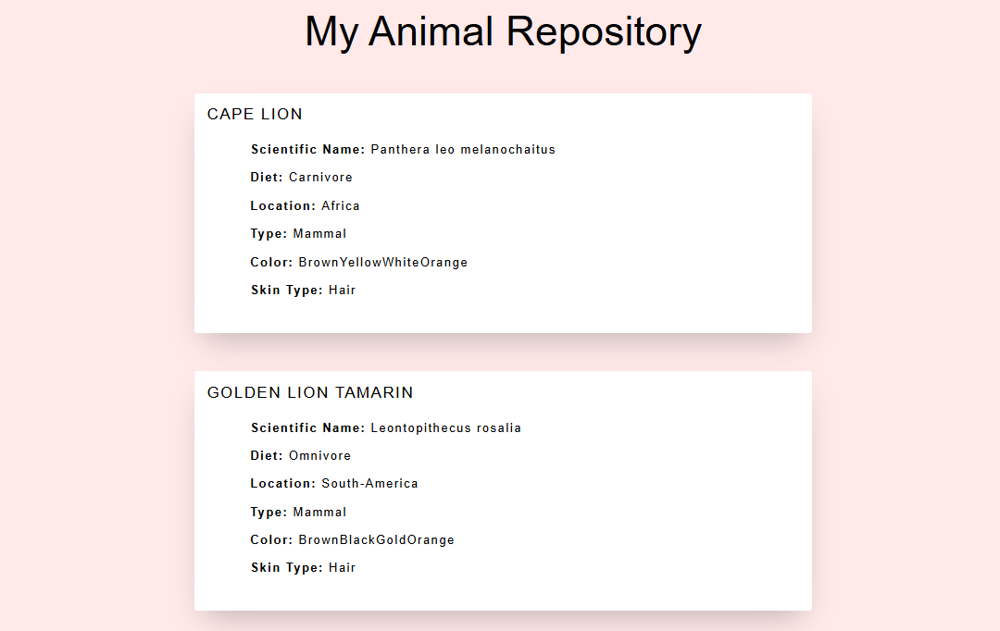

# 🐾 Animal Explorer

Animal Explorer is a lightweight web application that fetches animal data from an external API and displays it in clean, responsive animal cards. This project was built as part of my AI Engineering studies to practice working with APIs, managing project configuration and documentation, and creating dynamic web content.

## 🚀 Features

- Fetches real-time animal data from an API
- Dynamically generates animal information cards
- Clean and responsive user interface
- Error handling for failed API requests
- Beginner-friendly code structure

## 🛠️ Technologies Used

- Python
- HTML5
- CSS3
- REST APIs
- Git & GitHubHTML5

## ⚡ Installation

To install this project, clone the repository and install the dependencies listed in requirements.txt:

- git clone https://github.com/your-username/animal-explorer.git
- cd animal-explorer
- pip install -r requirements.txt

## ▶️ Usage

To run the application, run the following command:
```command
python animals_web_generator.py
```

## 📸 Preview



